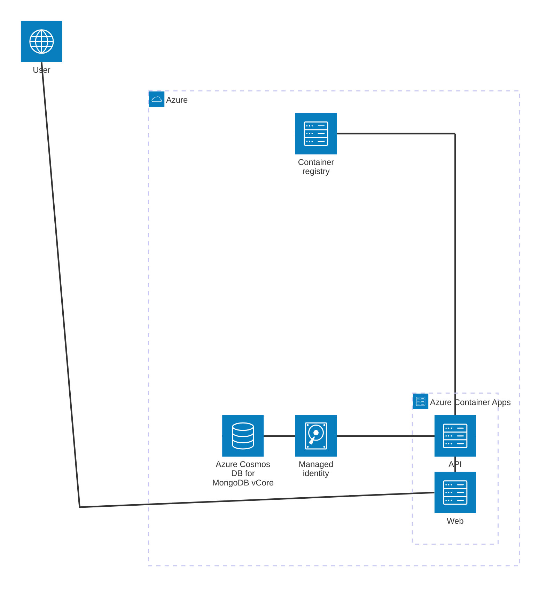
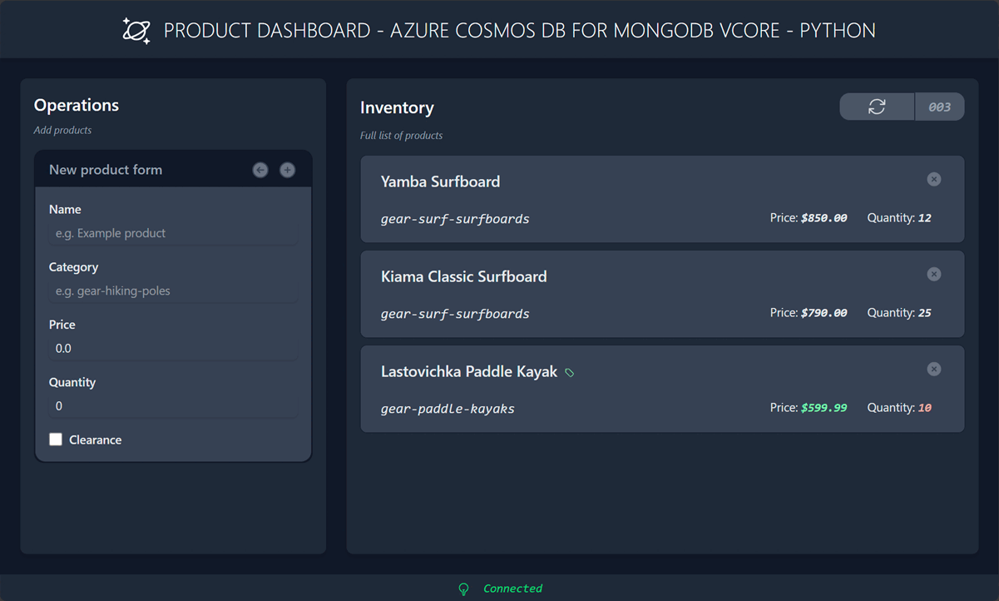

# Azure Cosmos DB for MongoDB vCore Quickstart - MongoDB driver for Python

This Quickstart is a Express API application that illustrates basic usage of the MongoDB driver for Python with [Azure Cosmos DB for MongoDB vCore](https://learn.microsoft.com/azure/cosmos-db/mongodb/vcore). [Azure Cosmos DB for MongoDB vCore](https://learn.microsoft.com/azure/cosmos-db/mongodb/vcore/oss) is built on [DocumentDB](https://github.com/documentdb) providing a powerful and flexible solution for NoSQL database needs.

## Pre-requisites

- [Docker](https://www.docker.com/)
- [Azure Developer CLI](https://aka.ms/azd-install)
- [Python 3.12](https://www.python.org/)

## Deploy this solution

This solution is designed to be deployed to Azure with only a few commands. This template will deploy the following Azure service components:



1. Log in to Azure Developer CLI. *This is only required once per-install.*

    ```shell
    azd auth login
    ```

1. Initialize this template (`cosmos-db-mongodb-vcore-python-quickstart`) using `azd init`.

    ```shell
    azd init --template cosmos-db-mongodb-vcore-python-quickstart
    ```

1. Ensure that **Docker** is running in your environment.

1. Use `azd up` to provision your Azure infrastructure and deploy the web application to Azure.

    ```shell
    azd up
    ```

1. Observed the sample dashboard web application that targets your deployed REST API.

    

## (Optional) Run the solution locally

1. If you haven't deployed the solution already, provision the Azure infrastructure to deploy the Azure Cosmos DB for MongoDB vCore cluster with Microsoft Entra ID authentication enabled.

    ```shell
    azd provision
    ```

1. Navigate to the `src/api` folder.

    ```shell
    cd ./src/api/
    ```

1. Check that your environments secrets are loaded correctly in the *\*.env* file. The list should include:

    | | Description |
    | --- | --- |
    | **`SETTINGS__ENDPOINT`** | The endpoint to the Azure Cosmos DB for MongoDB vCore cluster |

    ```output
    SETTINGS__ENDPOINT = <azure-cosmos-db-mongodb-vcore-cluster-name>.global.mongocluster.cosmos.azure.com
    ```

1. Run the application.

    ```shell
    flask run
    ```

1. Test the local REST API with a few basic HTTP requests:

    - **Perform a health check (ping)**:

        ```http
        GET http://localhost:5000/status
        Accept: application/json
        ```

    - **Upsert a document into the collection**:

        ```http
        POST http://localhost:5000
        Content-Type: application/json

        {
          "id": "aaaaaaaa-0000-1111-2222-bbbbbbbbbbbb",
          "category": "gear-surf-surfboards",
          "name": "Yamba Surfboard",
          "quantity": 12,
          "price": 850.00,
          "clearance": false
        }
        ```

        ```http
        POST http://localhost:5000
        Content-Type: application/json

        {
          "id": "bbbbbbbb-1111-2222-3333-cccccccccccc",
          "category": "gear-surf-surfboards",
          "name": "Kiama Classic Surfboard",
          "quantity": 25,
          "price": 790.00,
          "clearance": false
        }
        ```

        ```http
        POST http://localhost:5000
        Content-Type: application/json

        {
          "id": "cccccccc-2222-3333-4444-dddddddddddd",
          "category": "gear-paddle-kayaks",
          "name": "Lastovichka Paddle Kayak",
          "quantity": 10,
          "price": 599.99,
          "clearance": true
        }
        ```

    - **Get a specific document from the collection**:

        ```http
        GET http://localhost:5000/bbbbbbbb-1111-2222-3333-cccccccccccc
        Accept: application/json
        ```

    - **Get all documents in the collection**:

        ```http
        GET http://localhost:5000
        Accept: application/json
        ```

    - **Get documents in the collection filtered by category**:

        ```http
        GET http://localhost:5000/category/gear-surf-surfboards
        Accept: application/json
        ```

        ```http
        GET http://localhost:5000/category/gear-paddle-kayaks
        Accept: application/json
        ```

    - **Delete a document from the collection**:

        ```http
        DELETE http://localhost:5000/cccccccc-2222-3333-4444-dddddddddddd
        ```
